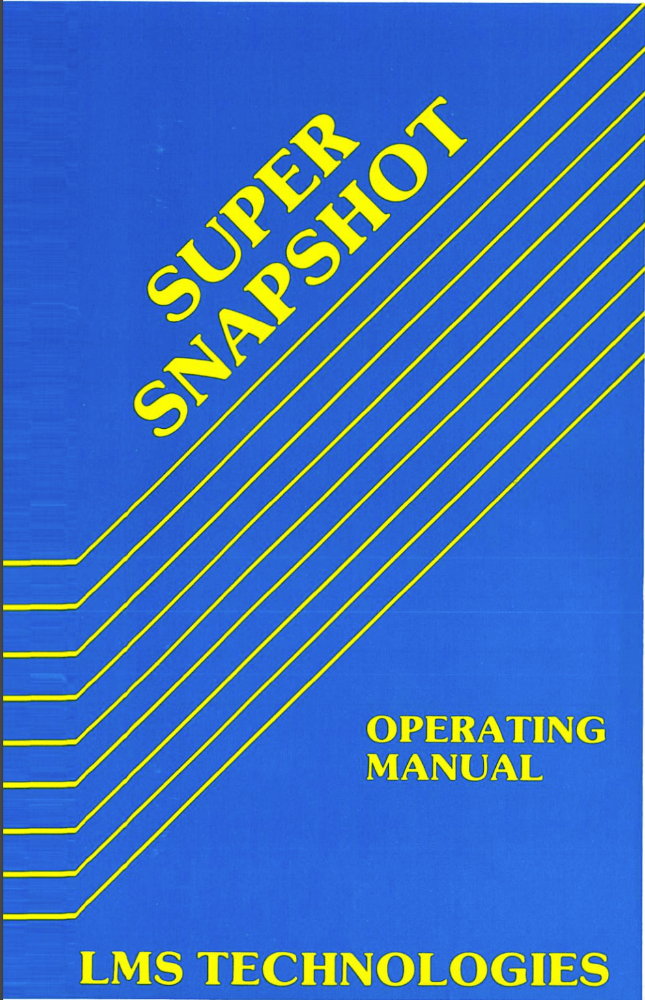

# Super Snapshot 5 Manual

## [Original File](Super_Snapshot_v5.0_Operating_Manual.pdf)

## Cover

## 1.0 INTRODUCTION

Congratulations and thank-you for your purchase of SUPER SNAPSHOT. To those of you who purchased this package as an update to a previous SUPER SNAPSHOT, welcome to version 5! Many hours of planning and design have gone into this product trying to ensure that it is as useful as possible to the end user. We have heard from many of our SNAPSH0T64 and SUPER SNAPSHOT customers and have taken into consideration all of the comments and suggestions that we have received. The result is SUPER SNAPSHOT V5.

We feel this cartridge represents a significant enhancement over previous versions and over what is available on the market today. We have strived to make this cartridge not only the best archiver on die market but to also make it an indispensable utility. To this end we have included along with the snapshot utility: a fast loading utility (TURBO DOS), a dos wedge, a screen dump utility, machine language monitor, REU support, utility menu, copier system, file management system, file readers, preprogrammed function keys plus many other useful utilities. With afffll of these features, there should be no reason for unplugging your cartridge. And this is only the beginning. That's right, future versions of the cartridge will include other valuable utilities. But where does that leave you since you have bought this version? The answer is .... in a great spot. SUPER SNAPSHO's unique design allows it to be openended. That means that you will be able to update to the latest version very easily and at a very reasonable cost. More on this later.

**Please read this manual thoroughly as it contains important information on the operations and capabilities of this cartridge.**

### 1.1 SYSTEM REQUIREMENTS

SUPER SNAPSHOT requires a Commodore 64, 64C, SX 64, 128 or 128D On the 64 mode) and will use the following drives; 1541, 1541C, 1541II, 1571, 1581 or 1541 compatibles such as the FSD, Indus, Commander,
MSD, etc.

### 1.2 PACKAGE CONTENTS

Your SUPER SNAPSHOT package should include the following: 1) SUPER SNAPSHOT cartridge, 2) one instruction manual, 3) a warranty registration form and a SUPER SNAPSHOT SYSTEM DISK. PLEASE NOTE: You MUST fill out your warranty registration form and return it in order to be informed of future upgrades.

We encourage you to make a backup of your system disk (both sides). It is unprotected and can be copied using any good copier such as the one supplied as part of this system. Put your original away and use the copy from now on.

### 1.3 SET UP PROCEDURE

With your computer turned OFF, very carefully insert SUPER SNAPSHOT into the cartridge port (with the computer facing you it is the furthest port to the right) with the label side up.

**NOTE:** Inserting the cartridge into the computer with the power turned on can be very hard on your computer and your pocket book, so make sure that your computer is turned off first. With the cartridge in place turn on your computer.

## 2.0 THE STARTUP MENU

You will immediately notice a distinct difference in the opening screen (or at least you should). Displayed on the screen at this moment should be an options window with our copyright in the background. You will also notice a status line that tells you that TURBO DOS (our custom fast loader) in on.
TURBO DOS is always active upon power up since we believe that you will always want to use it whenever possible.

At this point six options are shown to you. F1 is the beginning of the program backup procedure (section 3.2), F3 takes you to our DISK UTILITIES, F5 activates the EXTENDED LIFE module (section 2.2), F7 will jump to basic with all features enabled and execute the auto-boot sequence. The DELETE key will exit to basic with all features enabled but will NOT execute the auto-boot sequence and F8 will exit to basic with all features turned off. See the section titled BOOTSECTOR SUPPORT (section 11.0) for more details ony the auto-boot feature.

### 2.1 DISK UTILITIES

If, from the opening screen you selected F3 you will be presented with the DISK UTILITIES menu. From here you have four choices and they are 1) FILE SYSTEM, 2) DISK COPIERS,3) NIBBLER and 4) PARAMETER COPIER.

### 2.1a FILE SYSTEM

Selecting option 1 will present you with our file copier menu. The file copier supports 1 or 2 drives (devices 8,9,10 and 11) and the drives can be 1541, 1571 or 1581, any combination. This means that you can, for example, copy files from a 1541 to a 1581, including partitions, or visa versa. All you have to do is select which will be source and which will be destination (by using the F1/F2 and E3/F4 keys). If one of the drives being used is a 1581, a second menu will appear allowing you to pick the source or destination directory. F5/F6 will allow you check the directories of the source and destination drives respectively. The copier detects which drive(s) it is working with and implements the appropriate transfer routine(s) automatically.We have not found any file copier that is as fast or as flexible as this one.

**NOTE:** If you have a 1571 drive and you wish to make use of its increased storage capacity, you must first send a special command from basic BEFORE going to the copier system. The command is >U0>M1. This sets the 1571 into 1571 mode. Next you must send the disk format command (>N0:name,id). Now you are ready to go to the copier system. For further information on the 1571, see the section titled USING THE 1571 (section 13.0) which appears later in this manual.

Pressing F7 will take you to the FILE UTILITIES MENU. The first thing to note is the DEVICE line. This tells you which drive that you will be working with. The following is a summary of the options available on this screen.

1. DIRECTORY - This will give you a directory listing of the current selected device (unit 8 is the default).
2. SOFTWIRE DEVICE NUMBER - This command is for those of you who wish to use two drives for file copying but only have two unit 8's. To use this option turn on ONLY THE DRIVE WHOSE NUMBER YOU WISH TO CHANGE. Press 2 and you will see the DEVICE number change from 8 to 9. Your drive is now identified as unit 9. Now turn on your other drive. You now have units 8 and 9 to work with.
3. RENAME FILES - Here is an easy way to change the name of any file(s). Press 3 and a directory of the current device will be given. Using the cursor keys and space bar, select the file(s) that you wish to rename. When all the desired files have been selected press return. The old name of the file(s) will be given and you simply type in the desired new name at the prompt.

4. SCRATCH FILES - The scratch feature follows the format used in the RENAME FILES option. Use the cursor keys and space bar to select all files that you wish to delete. When the files have been selected press return.

F1/F2 - Pressing F1 or F2 allows you to select the DEVICE to be used in the FILE UTILITIES MENU. The default is unit 8 which means that all of the commands (scratching, renaming and softwire) will be directed to that drive. If you wish to access another drive (ie 9) then press F1. The on screen DEVICE will change from 8 to 9. All subsequent commands will be sent to drive 9.

Pressing SPACE will return you to the main FILE COPIER MENU.

There is a new option in the FILE COPIER MENU called BUFFER CONTROL MENU. Pressing the F8 key will bring up this new option. From here you can determine the amount of buffer that the file copier has to use. As shown on the screen, there are four potential sources of space available depending upon your particular system. There is the (1) COMPUTER RAM, (2) C128 VIDEO RAM, (3) RAM EXPANDER (any size) and (4) 32K CARTRIDGE RAM (see section 14.0). SUPER SNAPSHOT will sense automatically what buffers are available and will use them unless otherwise instructed. Available buffers will have ON displayed beside them. Pressing the appropriate key (1,2,3 or 4) beside the desired buffer option will toggle the buffer on or off. If you try to turn ON a buffer source that is not there, a NOT PRESENT message is displayed.

Pressing SPACE will return you to the main FILE COPIER MENU.

### 2.1b DISK COPIERS

The second option in the DISK UTILITIES is the DISK COPIERS. After
selecting this option you will be presented with the disk copier menu. The disk copier supports the 1541, 1571 (in 1541 mode) and the 1581. It automatically senses what drives are present and their type. This information is displayed at the top of the menu. The following is a list of commands and their usage.

(C)-COPY DISK Starts the copy process.

(B) - BUFFER CONTROL MENU Pressing this key will allow you to determine the amount of buffer that the disk copier has to use. As shown on the screen, there are four potential sources of space available depending upon your particular system. There is the (1) COMPUTER RAM, (2) C128 VIDEO RAM, (3) RAM EXPANDER (any size) and (4) 32K CARTRIDGE RAM (see section 14.0). SUPER SNAPSHOT will automatically sense what buffers are available and will use them unless it is otherwise instructed. Available buffers will have ON displayed beside them. Pressing the appropriate key (1,2,3 or 4) beside the desired buffer option will toggle the buffer on or off. If you try to turn ON a buffer source that is not there, a NOT PRESENT message is displayed. Pressing SPACE will return you to the main disk copy menu.

(M) - SINGLE DRIVE COPY Selects between single and dual drive copy mode. The default is single but pressing this button will switch to the dual mode and the message "DUAL DRIVE COPY" will appear. NOTE: You can only use the two drive option between similar drives! For example 1541 to 1541 is allowed as is 1581 to 1581 but 1541 to 1581 is NOT allowed. If you press the MODE key, a second status line will appear below the F1/F2 option.

(F) - FIX DRIVE If you have two disk drives and they are both device 8, you can temporarily change the device number of one of them using this option. To do so select this option and follow the prompts.

(K) - DISK COMMAND This allows you to send any command to the specified drive. The desired drive is chosen using the F1/F2 key (see below). When you press K a ">" will appear at the bottom of the screen with the cursor flashing beside it. Just type the desired wedge symbol.

(X) - EXIT Takes you from the DISK COPIER back to the opening menu of SUPER SNAPSHOT.

F1/F2 - SOURCE DRIVE Selects the source drive.

F3/F4 - DESTINATION DRIVE Selects the destination drive. This line appears only when you chose the dual drive mode (pressing the M key).

F5/F6 - STARTING TRACK Selects the starting track. F5 increments the track number while F6 decrements the track number.

F7/F8 - ENDING TRACK Selects the ending track. F7 increments the track number while F8 decrements the track number.

S/D - DIRECTORY Gives the directory of the source and destination drives (as determined by using the F1/F2 and F3/F4 keys).

### 2.1c NIBBLER

Option three is the NIBBLER When you choose the nibbler option from the menu, SUPER SNAPSHOT prompts you to insert the SYSTEM DISK and the nibbler (SHOTGUN II) is loaded. When prompted, either select the one or two drive version which will then load. Next a menu of user defined prompts will be displayed. Let's go through the options and features specific to each version.

SINGLE DRIVE VERSION:

1) Starting Track No.: Press 1 to enter the changes. Defaults to 01 but any track number from 1 to 80 may be selected.

2) Ending Track No.: Press 2 to enter changes. Defaults to 35, but any track number from 1 to 80 may be selected. Please note that tracks 41-80 should only be programmed while using a 1571 formatted disk. This copy is made with out actually flipping the disk. Although you may select tracks 1-80, we suggest copying tracks 1-35 and then tracks 41-75. This will save time in most cases.

3) Density Detection: Defaults to OFF and may be toggled ON by pressing the 3 key. (Don't use this feature unless you suspect whole track non-standard density. Superkit 1541TM for example.)

4) Drive No.: Press 4 and select 08,09,10, or 11. 

F1/F3: View Disk Directory of copy drive.

C: Begin Copy process. Follow on screen prompts.

RESTORE: You may abort the copy process at any time by hitting RESTORE. If you abort while the drive is active, we suggest that you turn the drive off and on again.

One drive copier hints and tips.

We suggest you use default values when copying any commercial program, protected or not. If the copy fails, set the end track to 40 and recopy. Be sure to write protect the copy before attempting to test it. Some programs will fail if the write protect is missing. The Shotgun II contains our system for copying RapidlokTM protected disks. This protection scheme is touchy, but we have had excellent results. If the copier prompts you to reinsert the Shotgun II while copying, it is going back to pick up the proper RapidlokTM copier. Again, just follow on screen prompts. One final word on RapidlokTM protection. If the copier has prompted you to reinsert the Shotgun II,you do have a RapidlokTM protect ed disk. If your backup fails, attempt again but first be absolutely sure that ALL, and we mean ALL peripherals are disconnected from your system. Strip the system down to a keyboard, a monitor, and one disk drive. This also includes special copy cables, chips, and other such hardware. After a successful copy has been made, start adding a piece or two back to the system (one at a time) until the problem has been identified. It may be as simple as a modem and as sneaky as a second drive on line but not even powered in. Companies known to use RapidlokTM are: AccoladeTM, Avalon HillTM, MicroproseTM, AvantageTM, CapcomTM, DreamriderTM. Others probably exist. Finally, we want you to know that it is normal for the system to reset to BASIC after copying RapidlokTM protected titles. Take this opportunity to test your backup.

DUAL DRIVE COPIER From the menu, the following options are available.

1) Same as one drive version.

2) Same as one drive version.

3) Same as one drive version.

4) Source drive: Defaults to 08 but may be changed to 9, 10, or 11 by pressing 4 and keying in your change.

5) Destination Drive: Defaults to 09 but may be changed 8,10, or 11 by pressing 5 and keying in your change.

F1/F3: View directory of source drive (F1) or destination (F3).

C: Same as one drive version.

Software Wire: From the main menu, you may change the device number of your drives through a software method. Hit S and follow on-screen prompts.

In order to return to the SUPER SNAPSHOT main menu, hold down the Commodore key and press the button on the cartridge.

### 2.1d PARAMETER COPIER

The PARAMETER COPIER is option 4 on the DISK UTILITIES menu. "What is a parameter?" you may ask. A parameter is a short routine that will make a minor adjustment to a disk so as to remove any protection routines. We have examined the market and in our opinion the KRACKER JAX parameter disks are the best of their type. For this reason we have made an arrangement with the KRACKER JAX people whereby they will offer a special parameter disk that will include parameters for only those programs that SUPER SNAPSHOT cannot completely copy.

Selecting 4 will bring up the usual prompt. After pressing RETURN the parameter menu will appear with a list of the titles supported. You may scroll up or down through the entire parameter selection. To the left of the titles is a display that will tell you what kind of copier is first required before running the parameter. **NOTE:** Custom Copier and nibbler refer to the same thing, SHOTGUN II.

As a final note, if you wish to exit from the DISK UTILITIES menu, simply press return.

### 2.2 EXTENDED LIFE

F5 on the option screen executes the EXTENDED LIFE routines. This option can be best explained by the following example: You are playing the toughest shoot-em up to ever hit the market. After what seems to be hours (and probably is) you make it to level 99 only to find that you are down to your last man. As soon as you lose this one it's back to the beginning again. What you do now is press the cartridge button which will interrupt the game (giving you a breather) and send you to the SUB SYSTEM MENU. Now press option 7 (RESUME) and continue to play. Eventually it's curtains and the game is over. The difference now is you don't have to start over! Simply reset the computer by using the Commodore key and the cartridge button (do NOT turn it off and on). When the opening screen appears press F5 (EXTENDED LIFE) and you are right back to level 99 where you were just before you pressed the cartridge button.

This may sound quite tricky but it actually is just part of the snapshot process. When you pressed the button, all of the IO's and registers were copied onto our cartridge ram. EXTENDED LIFE simply resets all the registers to match the image on the ram, similar to the resume feature after the SNAPSHOT process.

EXTENDED LIFE does work the majority of the time but not all of the time. For example, it will not work if the program loaded in a new file after you pressed the cartridge button. If the background of the screen changes, this also could cause problems. The best thing to do is to press the cartridge button each time you progress a little further into the game. Experimentation will soon teach you when and where to use this handy option.

### 2.3 EXITING TO BASIC

There are several ways of exiting the opening menu. F7 will exit to basic, leave the TURBO DOS active and perform an autoboot (see section 11.0 for information on the autoboot feature). F8 will exit to basic and turn off all of SUPER SNAPSHOTS features making it invisible. This means that TURBO DOS is turned off and all subsequent loads and saves will be at normal speed. The DELETE key will take you to basic, leave TURBO DOS active, but will not perform an autoboot.

## 3.0 MAKING A BACKUP

The archiver portion of SUPER SNAPSHOT (accessed as option 1 in the SUB-SYSTEM MENU) is the most effective memory capture utility on the market (domestic or foreign). It will produce a working copy of any program that is entirely memory resident. Even many programs that load in files after the program has begun can be successfully backed up.

###  3.1 LIMITATIONS

There are some programs that cannot be copied 100%. These programs include ones that are dongle (key) protected; do a protection check after the program has loaded and started and programs that use the drive's memory for protection or for alternate communication routines.

The programs that cannot be successfully backed up can be easily identified. Key protection is self evident. Programs that use the disk drive's memory are easily identified as well. To do so, load in the original program and when it has started, turn your drive off and then on again. If the program crashes or locks up when it tries to access the disk (the drive will not come on at ALL) you can safely assume that it uses special routines that were placed in the drive's ram.

To determine whether the program is using a late protection check, make an unprotected copy of the original disk (using the fast copier included on the parameter disk). Load in the program using the original disk. When the load is completed and the drive has stopped spinning, replace the original with the copy. If the program crashes or refuses to accept the copy when it next accesses the drive, it indicates that there is a late protection check routine.

Until now, these types of programs could not be handled by a cartridge based copier. Our tests show that SUPER SNAPSHOT can still make backup copies of much of the software on the market today; however, for those that it can't, we have made provisions for this through the SUPER SNAPSHOT SYSTEM DISK. This disk is designed to keep you current by providing parameters for those "problem" programs. These parameters are produced by the KRACKER JAX team from SOFTWARE SUPPORT INTERNATIONAL. Their address is given elsewhere in this manual.

### 3.2 STARTING THE SNAPSHOT PROCESS

The F1 option on the opening screen is the first step in the SNAPSHOT process. Selecting this option will enable another window where you will be asked to confirm your selection. Pressing "Y" will pre-configure the computer's memory with a pattern that SUPER SNAPSHOT will recognize. This is done so that SUPER SNAPSHOT will only save that memory which is actually part ofthe program being backed up and therefore minimize the size of the files that will be saved. This feature will be used by you 99% of the time. However, it is not necessary to pre-configure memory. If you don't it only means that your files will be larger. We offer the option because we have found software that actually looks for a pattern in memory as part of a protection scheme designed to defeat cartridge based copiers.

After you have made your selection you will be returned to the main menu where you will choose to exit via the DEL(ete) or F8 options (DEL most of the time) to basic. Choosing F8 will take you to the standard COMMODORE start up screen with all of SUPER SNAPSHOTS features disabled. In this state the cartridge is COMPLETELY invisible. Even the computer can't see it. There are some programs that check the cartridge port as part of their protection scheme so the invisibility option is very important. Having chosen DEL or F8 you would now load in the original program.

When the program is finished loading, press the button on the cartridge. The SUB-SYSTEM MENU will now appear and the status ofTURBO DOS is given along with the number of the drive being used (upper right hand corner of the menu). If you have two drives and you wish to save the backup to drive 9 simply press SHIFT/3 (which is the # sign). The device number shown will change to 9 and all disk activity will be directed to 9. You can go back to 8 by pressing a#" again. If you are using one drive only, turn the drive off and then on again. If the program is using alternate communication routines and you wish to save to device 9, you MUST first turn drive 8 off and on.

Press 1 (SNAPSHOT) and you will be taken to the snapshot screen. There you will be asked for the desired name of the file. The next prompt will be to insert the destination disk and press return. The program in memory will be saved into one file including the boot. The only exception is if the program cannot be compacted to 202 blocks or less. In this case SUPER SNAPSHOT will ask if you wish to save as one or two files. The reason for the two file save is that the only loader that could load a file larger than 202 blocks would be the one on SUPER SNAPSHOT. In other words, the program would not load without SUPER SNAPSHOT installed.

You can return to any previous requester (clear back to the SUBSYSTEM MENU) by having no characters and hitting RETURN.

Pressing any key will start the saving process. This process takes approximately 30 to 90 seconds and a message will appear to inform you when it is finished. Pressing any key will take you back to the SUB-SYSTEM MENU where you can resume the program or access any other of the cartridge features.

## 4.0 SUB-SYSTEM MENU

Option 1 of the SUB-SYSTEM MENU is for archiving programs (as described above).

### 4.1 SCREEN-COPY

SCREEN-COPY is the name given to our screen dump utility because what you get with this option is just that! You can get a screen dump of virtually anything (graphic or text including sprites). This dump will work with the Commodore 1525, Epson, Epson compatibles, Commodore 801, Commodore 802 or Commodore 1526. If you are using a STAR NX-1000 Rainbow or an Epson JX-80 you can have your dumps done in full color!

To use SCREEN-COPY load in your program and when the screen that you wish to dump appears press the button on the cartridge. When the SUB SYSTEM MENU appears select option 2 and you will enter the SCREEN-COPY system.

Although you can interrupt at virtually any point it is best to do so when there is no drive activity. If the drive is busy when you interrupt, you will get a SCREEN-COPY but the program will likely crash when you resume. Also, if the program happens to be using alternate communication routines, you will have to turn the drive off and on in order to free up the serial bus.

Upon entering SCREEN-COPY you will see that the type of screen being displayed has been identified as being one of five different types. They are 1) standard bit mapped, 2) standard character, 3) multi-color bit mapped, 4) multi-color character or 5) text. You will also be told how many sprites have been enabled.

Next you are presented with four different graphic options along with the option to return to the SUB-SYSTEM MENU.

Option 1 is for dumping a text screen to your printer.

Option 2 is for dumping graphic screens to your printer. Should you wish to dump the current screen to a printer by selecting option 2, you should first set the defaults which appear at the bottom of the SCREEN-COPY menu. The following is a brief description of the defaults:

- F1 - allows you to choose the appropriate printer type. The choices include 1525, 1526, Epson and color. If you have a 1525 or compatible (such as the Gemini II) you should choose the 1525 setting. If, on the other hand, you are using an Epson or Epson compatible (as a Panasonic 1092) you would choose the Epson setting. Should you be fortunate enough to own an Epson JX-80 or STAR Rainbow, you have the option of printing out your screens in full color just by choosing the COLOR option. Commodore 1526 or 802 users would select the 1526 setting. SUPER SNAPSHOT has the ability to store custom printer drivers on its ram and SCREEN-COPY has the ability to access these drivers directly. In the future any new printer drivers will be posted on our support BBS (section 16.0) and will be available for downloading.

- F2 - print sprite option. This key will allow you to include or exclude the sprites that were on the screen at the time you interrupted.

- F3 - will print the screen with the colors being opposite to what they appear. Sometimes this option will produce a more desirable screen dump.

- F5 - toggles between the three screen sizes available. Small is approximately 4.5 x 3.25; medium is 6.75 x 6.75 and large is 8.75 x 7.5 (which is the exact screen size). Dimensions given are those produced when using an Epson or Epson compatible printer.

-F7- is an option for 128 users only. If you have a 128 you can kick it into 2 megahertz mode (for printing) and significantly decrease the print time. Using this option will blank the screen during printing.

- SP(ace) bar - toggles between the SCREEN-COPY menu and the screen that is to be printed.

Option 3 is for saving the screen contents to disk. The files can be saved to a variety of formats depending upon the type of graphic mode that was being used by the program in memory. A window will appear and the available graphic formats will be displayed. Choose the desired format and supply the desired file name when prompted. Only the file name itself is required since SUPER SNAPSHOT supplies any necessary prefix or suffix. The saved files can then be loaded in by the appropriate drawing program or by SUPER SNAPSHOT itself.

Option 4 is for loading previously saved picture files. When you choose this option a window will appear with all of the graphic formats supported by SUPER SNAPSHOT. Choose the desired file type and supply the name of the file that you want loaded. SUPER SNAPSHOT will supply any necessary prefix or suffix. Once the file is loaded it may be viewed and/or printed.

Option 5 will exit SCREEN-COPY and go to the SUBSYSTEM MENU.

There are several other features built into SCREEN-COPY. Pressing any key during printing will cause the printer to stop at the end of the next line. You will be asked if you wish to abort and you will answer (Y)es or (N)o. Finally, with some interfaces, there occasionally is a problem accessing the printer. If this happens SUPER SNAPSHOT will inform you of the problem and ask you if you wish to (A)bort or (R)etry.

### 4.2 GAME MASTER

This new addition to SUPER SNAPSHOT is accessed as option 3 of the SUB-SYSTEM MENU. The menu contains several features that are in tended to make those tough games a little easier.

1) JOYSTICK PORT SWAPPER How many times have you loaded up a game, all set to reach the highest score yet only to find out that you have your joystick in the wrong port? The only thing to do is to shut your system off, switch joystick ports and reboot. Well, that scenario is a thing of the past. SUPER SNAPSHOT now has the ability to switch the joystick port that is currently active. Just select option 1 of the GAME MASTER MENU and the switch is done automatically. Now you can resume your game without manually switching joystick ports.

2) SPRITE KILLER Also built into SUPER SNAPSHOT is the ability to disable sprite collisions. To disable the sprites press the cartridge button and select option 2 from the GAME MASTER menu. Using the sprite disable commands you can kill (1) sprite to sprite collisions, (2) sprite to background collisions or (3) both. After a sprite command has been executed the message - DONE will appear. Pressing RETURN will take you back to the GAME MASTER menu. If the disabling was successful then the sprites will pass through one another allowing you to continue through the whole game without losing a life. Often, however, there will appear to be no effect from the sprite disabling. This is because what appeared to be sprites are actually user-defined characters or the programmer may be using some other method besides the VIC chip for detecting collisions.

3) SPRITE RE-ENABLE We have also included a sprite re-enable feature. This command will turn on all sprites that you had previously turned off. Once the command is executed the message DONE will appear and you
will be returned to the GAME MASTER MENU.

4) JOYSTICK AUTOFIRE Another handy utility is the autofire option. This feature was designed for those games that require continuous pressing of the fire button. Select 4 and when the process is complete you will be returned to the GAME MASTER MENU.

5) Option 5 returns you to the SUB-SYSTEM MENU.

### 4.3 UTILITIES

From the SUB-SYSTEM option 4 is the UTILITY MENU. From it option 1 allows you to set up for a new snapshot (fills memory with the snapshot pattern).

Option 2 of the utility menu allows you to determine the status of TURBO DOS (both load and save), the function keys and the wedge. At this point you can turn each one off or on individually by simply scrolling the cursor to the desired function and pressing the space bar. Your changes will be implemented once you exit back to the program.

Option 3 allows you to check the directory of the disk in the specified drive. You need a maximum of 271 free blocks to save a snapshotted program. Although we have never seen a program take up that much room, if you allow that much you will never run into a disk full error.

Choosing option 4 will allow you to send commands to the disk drive. You can do several things such as format the target disk, scratch files from the target disk,etc. The commands are similar to that of the wedge. You are presented with the ">" and only have to type "FN0:name,id" to format a disk, for example.

Selecting option 5 in the UTILITY MENU will return you to the SUB-SYSTEM MENU.

### 4.4 MONITORS

Option 5 of the SUB-SYSTEM MENU displays the various monitors contained within SUPER SNAPSHOT. The following is a list of the various monitors and a description of each.

#### 4.41 M/L MONITOR

Your new SUPER SNAPSHOT cartridge contains a very powerful machine language monitor called CODE INSPECTOR V5. Its capabilities are a hacker's dream come true. Did you ever wish that you could find out what was going on inside a program as it was running? Well, nowy ou can! By pressing the button on the cartridge and going to the SUB-SYSTEM MENU (or alternatively holding down the CONTROL key and pressing the cartridge button when outside the SUPER SNAPSHOT system), you can enter into the monitor. There you will find the status of all the registers at the point when you pressed the cartridge button. You can tell what exactly was going on when you interrupted. And all this can be done without corrupting memory! That's right, you can take a look at what is going on, make a few changes and then resume the program with the only changes being the ones that you made. Now you can begin to see the potential of this utility!

We cannot attempt here to teach machine language and such is not our intent. Although the monitor is easy to use, a certain amount of machine language knowledge on the part of the user is necessary.

The following is a list of the commands supported by the monitor along with an example of their usage.

A - assemble eg. A 2000 LDA#1  
Assemble an instruction at $2000. The next address will be then displayed and be available for a further instruction.

BR - break vector eg. BR

Sets break vector to enter monitor.

C - compare eg. C1000 2000 3000  
Compare the memory from $1000 to $2000 with the memory starting $3000. If there are any differences, the addresses of the differences will be listed.

D - disassemble eg. D 2000 3000  
Disassemble memory from $2000 to $3000  
D alone will display 20 bytes past the last line disassembled.

F - fill memory eg. F1000 9000 FF  
Fill memory from $1000 to $9000 with the byte FF. Any number of bytes may be used and may include Ascii (if preceded by a " ). If no byte is specified the default BB is used.

G - go eg. G9000  
Load the registers with what was shown in the register display and start executing thecode at $9000.

H - hunt eg. H 3000 5000 FF  
Hunt for the byte FF from memory location $3000 to $5000. You may now specify an Ascii hunt by simply enclosing the Ascii portion in quotes.

eg. H 2000 3000 "FRED"

You may also mix Ascii and hex.

eg. H 20003000 01FF 00 "FRED"

The H command also allows a hunt for a string of any length and may includeAscii, decimal and/or hex.

I - interpret eg. IC000 D000  
Interpret memory from $C000 to $D000.

IO - display IO registers eg. IO  
Displays the status of the IO registers at the point the program was interrupted.

L - load a file eg. L"file",08 or LS "file",08  
Load a file from device 8. The S is optional and signifies a slow load. This is used for loading directly into the snapshot image under any ROM configuration.

M - memory display eg. M 4000 5000  
Display memory from $4000 to $5000.

O - output to device eg. O4  
Output can be to screen, printer or disk. The default is 3,7 (screen). To output to a printer the command would be O4.

R - register display eg. R  
Display the contents of the various registers. These contents will represent the status at the time the program was interrupted.

S - save a file eg. S "name",08,1000,2000 or SS "name",08,1000,2000  
Saves a program called name which resided from memory location $1000 to $2000 to device 8. The second S is optional and denotes as lowsave and is used for saving directly from the snapshot image under any ROM configuration.

SP - disable SPrite collisions eg. SP  
Disables both sprite to sprite and sprite to background collisions.

SPB - disables only SPrite to Background collisions, eg. SPB

SPS - disable only SPrite to Sprite collisions, eg.SPS

SPR - re-enable all sprites turned off by SP, SPB and SPS commands. eg.SPR

T - transfer memory eg. T1000 2000 3000
Transfer memory from $1000 to $2000 to $3000. The transfer command allows memory area overlap. For example, you can take a block of memory and move it up or down by 1 byte.

X - exit eg. X  
With the X command, you will exit the way you entered.

XB - exit eg. XB  
The XB command will exit you to basic no matter how you entered the monitor.

XM - exit eg. XM  
Using the XM command will exit you to the SUB-SYSTEM MENU regardless of how you entered.

: - memory modify eg. :8000  
Allows the direct modification of memory. Input can be in hex or Ascii
(preceded by the ")

; - register modify  
Modify the contents of the registers. Simply type over the desired byte.

, - disassembly modify eg. ,8000  
The disassembly can be modified by typing over the desired byte.

"#" - convert hex to decimal eg. #C000  
Shows the decimal value of a hexadecimal number. In our example, the figure +49152 would be returned.

"#+" - convert decimal to hex eg. #+49152  
Shows the hexadecimal equivalent of a decimal value. In our example, the value $C000 would be returned.

"+" - used when entering locations in decimal, e.g. D +49152 would be the same as DC000.

$ - display disk directory. Same syntax as in the wedge.

"*" - IO modify. Gives you the ability to change the values displayed by the IO command. Simply type IO and then cursor up to the desired byte, make the appropriate change and press return.

@ -read drive error channel.

@#n - where n is a number from 8 to 11, determines the default device number. This follows the same conventions used in our wedge.

" * Rn" - where n is a number from 0 to 7 and represents a specific bank in a ram expansion unit. See REU MON (section 4.41d).

*V- accesses the C128 video ram. See VIDEO MON (section 4.41c).

Several of the function keys have been assigned commands for use within the monitor. They are:

F1 - moves cursor to bottom left of screen.

F3 - gives directory of device 8.

F5 - acts as delete key. It will delete the character beneath the cursor and move all succeeding characters on the current line one to the left.

Along with the function keys, the monitor now enjoys full support of our dos wedge (with the exception of the fast format command).

There have been several special features, not seen in other monitors, built into CODE INSPECTOR V5. One that you will appreciate is the ability to omit leading zeros. This means that if, for example, you wanted to display  memory at 005F you need only type M 5F instead of M005F.

Another is the ability to enter POKES into memory through the monitor. For example if you wanted to POKE 53281,0 the equivalent monitor command would be :+532810. The colon is the memory modify command and the + converts the following decimal figures into hex.

The F (fill memory) and H (hunt for specified value) commands will default to BB (our memory pattern) if  you do not specify a value.

The monitor can also be accessed through your machine language program by first entering the monitor via the SUB-SYSTEM MENU (or F8). Once in the monitor, enter the set break vector command (BR). The message -DONE- will appear. Now you can exit back to BASIC by typing XB. From now on you can enter the monitor from within your machine language program through the BRK instruction.

There are many potential and varied uses for this utility. For example, in England it is very popular to make custom changes in programs to give indefinite lives, unlimited fire power, etc.

**NOTE:** There is an extra feature in the SUB-SYSTEM MENU that is not displayed on the screen. Pressing the letter T will toggle TURBO DOS on or off. The result of pressing the key is shown at the top of the window. This is merely a convenience feature in that it will turn on our fast dos enabling you to fast save the program in memory if, example, the program happened to turn the dos off while loading.

#### 4.41a M/L TRACK AND SECTOR EDITOR

Also included within the monitor is the ability to read and write sectors directly to and from a disk. This is accomplished using the following two commands:

U1-read a disk sector into memory. Syntax is U1 TT SS [3333].

U2-write a disk sector from memory. Syntax is U2 TT SS [3333].

U1 and U2 together form a simple track and sector editor, but with the advantage that all monitor commands can be used to edit the sector (e.g. M, I, D, A, H...etc). The two numbers following U1 and U2 are the track and sector respectively. Remember that unless you prefix these numbers with a V, they will be interpreted as being hexadecimal. For example, the following are equivalent commands to read the first sector in the directory ofa 1541 disk:

U1 +18 +01 - read track 18, sector 1.

U1 12 1 - read track 18 (=$12), sector 1.

If no optional address is specified, both U1 and U2 will default to address $C000 (ending at $C0FF). Any address may be specified as a third parameter.

A final note of caution! This is a powerful tool and as such it should be used carefully. We would suggest that if you wish to experiment with sector manipulation, you do so on a backup disk.

#### 4.41b DRIVE MONITOR

With this command you can access, examine or modify drive memory. All the regular display commands that are associated with CODE INSPECTOR are available in the drive monitor.

Drive memory is accessed with the following command:

*8 - read and write to device 8. The number can be 8 to 11 depending on the device being accessed. Note that in keeping with our monitor conventions, input can be in hex or decimal. For example, *8 refers to drive 8, *9 refers to drive 9 but in order to access drives 10 or 11, the command would be *A (or *+10) or *B (or *+11).

" * " - resets to computer memory. Transferring a portion of drive memory to computer memory is accomplished by using the following syntax: T 100 200 *3000

The * in front of the destination location informs the monitor that the intended location is computer memory. Sending computer memory to the drive would be similar except that the * would be in front of the first address.

The compare command can be used between the drive and computer's memory using the same conventions as the transfer command.

**NOTE:** Before attempting to transfer (or compare) drive memory with the computer's memory, you must first enable the drive memory access with the *n (where n is a number from 1 to 11).

#### 4.41c VIDEO RAM MONITOR

A new addition to CODE INSPECTOR is the ability to examine the C128 video ram. The video ram memory is accessed by the *V command. If your 128 has 16K of video ram it will appear from $0000 to $3FFF. Ifyou have 64K of video ram it will appear from $0000 to $FFFF. The same parameters and syntax that appear in the drive mon hold true for the VIDEO MON

#### 4.41d REU MONITOR

Along with being able to access the C128 video ram CODE INSPECTOR also supports working with the various ram expansion units. The command is *Rn where n is a number from 0 to 7 (the 8 possible ram banks). The REU's are accessed one bank at a time. If you are using a 1700 then the command could be *R0 to *R1; a 1764 could be *R0 to *R3 and a 1750 could be *R0 to *R7. The various banks, when accessed, appear from $0000 to $FFFF. The same parameters and syntax that appear in the drive mon and the VIDEO MON hold true for the REU MON.

#### 4.42 SPRITE MONITOR

Option 2 of the MONITOR MENU will take you into the SPRITE MONITOR From there you can view all of the sprites that are resident in the current program starting with the active sprites.

All commands are displayed on the screen along with seven sprites. You will notice that the center sprite (hereafter referred to as the current sprite) is double size. The address shown is for that of the current sprite. This is to clearly show which sprite will be affected by the various commands that are available to you at this time. The following is a brief description of the commands and their usage:

(F)orward - moves forward 64 bytes in memory. The sprites displayed will shift one position to the left with the leftmost sprite scrolling off the screen and a new sprite appearing at the furthest right.

(R)everse - same as Forward except the display moves back 64 bytes and the sprites shift to the right.

(M)ode-switches from hi res to multi color display. Some sprites are more easily viewed in this mode.

(L)oad - load a previously saved sprite from disk. This can be a sprite saved by the sprite monitor from another game or one generated by using the SUPER SNAPSHOT SPRITE EDITOR that is on your SYSTEM DISK.
The new sprite loaded will replace the current sprite at the address specified on the screen.

(S)ave - save the current sprite to disk to be loaded into another game or to be edited with the SPRITE EDITOR.

(C)lear - removes the current sprite from memory.

(E)xit - takes you back to the SUB-SYSTEM MENU.

(D)evice - allows you to select the desired device to load or save to.

There are only a couple of other things to note here. When loading or saving sprites the prefix 'smon' is given automatically. Using this prefix gives you an easy method of identifying sprite files in a directory listing as well as assuring compatibility with the SPRITE EDITOR. Lastly, the current Bank is shown on the display screen as well. This represents the video bank that is being accessed. The bank number will change as you scroll through memory and pass into a new bank.

#### 4.43 SAMPLE MONITOR

A sound sample is a way of recording any sound as a series of numbers. It is the same method used in synthesizer keyboards and compact disks. It could actually be called a "computer tape recorder." This method is becoming more and more popular in 64 software. With our SAMPLE MONITOR we have given you the ability to capture these samples and with the PLAYER module on your SYSTEM DISK, you can incorporate them right into your own programs!

Whenever you hear a voice or a very realistic sound in a game, chances are it is a sound sample. Many of these sounds can be captured for use in your own demo programs. You can even make music with them, plus simulate the sampled effects popular in dance music.

When you suspect that this method is being used in your software, try to press the cartridge button when it is being played. Choose the MONITOR option from the SUB-SYSTEM MENU and then choose SAMPLE MONITOR There is no way of automatically detecting where the sample is and what format it is in so you will have to help the program accomplish this. It is actually very easy and is done through experimentation with the different parameters. Chances are the settings will be similar to those shown so simply press'P to listen through the entire memory. If you hear the sound from the program at all, you are in luck! If not, you will have to experiment with the various fields. You can select the desired field by using the N (next field) and L (last field) keys.

START ADDR and END ADDR - If there is a lot of noise before the sound is heard, you ha using the N and L keys. Adjust the value on the screen by using SHIFT/I (increase) or SHIFT/D (decrease) and then try playing it again. Continue adjusting until the sound starts to play immediately. If you can come dose to the starting address but are still getting a bit of noise at the beginning use I or D alone to fine tune the address. You can change the END ADDR (ending address) the same way. Now you have the sample cornered! If at any time you wish to stop the sound from playing, press A to abort

FREQUENCY - If at this point it sounds like a record player at very high or low speed, you can fix it by adjusting the FREQUENCY setting. A lower number will result in the sound being played faster while a higher number will result in the sound being played slower.

FINE DIR -The sound may still sound distorted, with a ringing tone in the background. If this is the case try changing the FINE DIR from + to - (or visa versa).

COARSE DIR - If all this time it sounded like it may be something but wasn't quite recognizable, it may be playing backwards! Use the COARSE DIR setting to fix this (by pressing I). The START ADDR and END ADDR will swap places because now you are playing from the end to the beginning.

TYPE - If after all this you are still not getting anything, try changing the type from 1 bit to 4 bit. Now go through the process again and if you still don't get anything then try the 8 bit type selection.

These instructions were found to lead to the quickest road of success, but only practice will improve your speed. If all your effort leads to no success then the sample is probably a non-standard format which means it is stored in a very unique and complicated way. For these programs there is a chance that a parameter will be developed and made available on our BBS for downloading. A parameter is a program that will change these non- standard samples into a standard one.

To save a lot of time you should be able to recognize the sample type fairly quick. To this end we have included samples of all formats on the SYSTEM DISK. These can form the basis of your sample collection.

If you have been able to locate and isolate a sample, insert a blank disk and press S. The prompt FILENAME: will appear with the default SAMPLE given. You can change the default to any name that you wish up to 14 characters long. The sample will be saved into two files with prefixes of D. and I. respectively. The first file contains the sample itself while the second contains the settings used. The D. file is not likely to be more than 202 blocks in size.

As you can see, capturing a sample is quite fun but it also take some time. Things would be much better if everyone shared their findings with others. Leave a message on our BBS describing what kind of program your sample is from, the nature of the sound, the settings that you used and we will forward it to the other users and give you the full credit for the contribution. Remember...updates and special utilities are available for downloading.

Wouldn't it be great if everyone used the same format for sound samples? There are currently 10 different combinations of FINE DIR, COARSE DIR, and TYPE plus some non-standard formats. Now that can be the source of a lot of confusion. We have included a program on the SYSTEM DISK called CONVERTER to help with the problem.

First you must understand that TYPE'S are very different from one another but COARSE DIR and FINE DIR are simply variations of a TYPE. There should be only one format for each TYPE. Luckily there is already a standard for 8 bit TYPEs and it is called IFF 8SVX. It stands for Interchange File Format for 8 bit sampled voice and it is used on the Amiga as well as other brands of computers. IFF really refers to a group of standards which includes ways of storing pictures. The 8SVX is for storing sampled sounds. Unfortunately, 8 bit sampled sounds are unsuitable for smaller computers, such as the 64, since they are more accurate than can be played on an unmodified 64.

The most suitable format for the 64 is the 4 bit sample. Unfortunately limited Eprom space as well as technical considerations make it quite impractical to save directly into the 4 bit format. You will have to convert all your SAMPLE MONITOR files to this format using the CONVERTER utility. Once the files have been converted they are then suitable for use with the PLAYER module (section 12.3) and for use with SUPER SNAPSHOTSUDESHOW CREATOR PLUS.

#### 4.44 CHARACTER SET MONITOR

Option 4 of the MONITOR MENU is our CHARACTER SET MONITOR. This handy utility allows you to scan memory for custom character sets and save them as character set files. These files can then be used in your own programs or can be loaded back into a running program replacing the current character set being used. These character set files can also be used by SUPER SNAPSHOT SLIDESHOW CREATOR PLUS.
The commands in the CHARACTER SET MONITOR are straight forward and easy to use. The following is a list of the commands and their usage.

(F) - Forward scroll through memory. Holding the F key provides a continuous scroll through memory. All possible locations of character sets are displayed.

(R)-Reverse scroll through memory. Same conventions apply as above.

(M)-Multi ON/OFF toggles multi-color mode on and off. Some character sets are stored in a multi-color format. This option makes it easier to view these particular sets.

(L) - Loads a previously saved character set The load will be to the address specified beside ADDRESS. If there is a character set being displayed at a particular address, then the character set will be replaced by the what is being loaded. The prefix CHAR is displayed when the load option is selected. Files saved by the CHARACTER SET MONITOR have this prefix attached. If you wish to cancel the load, simply use the DEL key and erase CHAR, and press RETURN. If the program in memory is using fast load routines, it may be necessary to turn the drive off and then on to clear the serial bus before attempting a load.

(S)-Saves the displayed character set to a file on disk. The prefix CHAR is automatically given so all you have to do is to add your own identifier. All character set files are saved to disk with a beginning address of $0801. If the program in memory is using fast load routines, it may be necessary to turn the drive off and then on to clear the serial bus.

(1) -Toggles the color of the character set being displayed.

(2) -Toggles the color of the background.

(3) -Toggles multicolor 1 of the character set being displayed.

(4) -Toggles multicolor 2 of the character set being displayed.

(D) - Selects device number that all load and saves will refer to.

(E) - Returns you to the SUB-SYSTEM MENU.

Option 5 of the MONITOR MENU will return you to the SUB-SYSTEM MENU.

#### 4.5 SNAPTERM

Our cartridge based terminal program is accessed by pressing 6 from within the SUB-SYSTEM MENU. Although not meant to compete with more elaborate, disk based terminal programs, we are confident that you will find SNAPTERM all that you really need to enjoy telecommunications. The fact that it is cartridge based and accessible at the touch of a button means that it is way ahead in the convenience aspect.

The screen in SNAPTERM should have a black background and foreground while the character is cyan. The status line is yellow (reverse video) and should read as follows:

SNAPTERM C>0000 0:00:00 IN-P IN-P 1-3C1200N8F
         1 2    3       4 5       6 7  8  9AB

The various parts of the status line have the following meaning:
1 - Buffer mode and direction.

These two characters specify the buffer mode (Oclosed, O=open) and the direction (> = into the buffer, < = from the buffer). Thus C> means that the buffer is closed but when opened will be receiving.

2 - Buffer line.

This number indicates what line the buffer is currently at. This is updated for receive, send, load and save.

3 - Online timer.

Whenever there is a carrier present, this timer will count in seconds.
When the carrier is lost it stops. When the carrier comes back on, it resets.

4 - Modem type.

This section states the modem type.

50 -1650 and compatibles
60 -1660 and compatibles
NO - Hayes modems (normal control signals)
IN - Hayes modems (inverted control signals)

5 - Dial type.

This character specifies the dial type where P = pulse and T = tone. This only applies to Hayes type modems.

6 - Adjust character/line delay.

This section is for adjusting the character and line delay. The default setting of 1-3 is fine for normal telecommunications. The only time that these settings will have to be adjusted is when the user wishes to log on to older type main frames. Under all other conditions the settings should be left at the default.

7 - Carrier detect.

When a carrier is detected a C will appear. When there is no carrier detected the space will be blank.

8 - Baud rate.

This indicates the desired rate at which your modem will operate. These settings are dependent upon your particular modem but SNAPTERM supports 300, 400, 500, 600,1200, 2400, 4800 and 9600 baud. Please note that the 9600 baud rate should only be attempted on a 128 in the 80 column mode.

9 - Parity.

This field indicates the parity setting.

N - none
O - odd
E - even
M - mark (1)
S - space (0)
A - Data bits (either 7 or 8).

B - Echo mode.

This indicates echo (duplex) with F = full and H » half.

Several keys have special meaning when pressed together with the Commodore key. They are:
A - Dial the last number again.
B - Change the baud rate.
C - Change the buffer mode (< or >).
D - Input a new number to dial.
E - Change echo mode (duplex).
F - Toggle between 40 and 80 columns (128 only).
G - Status color.
H - Help screen.
I - Ink (character) color.
J - Print buffer.
K - Save buffer.
L - Load buffer.
M - Modem type.
N - Character delay.
0 - Border color.
P - Paper (background) color.
Q - Clear buffer.
R - Receive file (xmodem).
S - Send file (xmodem).
T - Dial type (tone or pulse).
U - Line delay.
V - View buffer.
W - Data bits (7 or 8).
X - Exit SNAPTERM.
Y - Parity.
Z - Clear screen.
1 - Send file (Punter). Must be installed in ram.
2 - Receive file (Punter). Must be installed in ram.
+ - Activate buffer.

To use the buffer it must first be activated with the Commodore + keys. When viewing the buffer, the following keys take effect:

CLR - Move to the top of the screen.
HOME - Move to the top of the buffer.
POUND - Move to the bottom of the screen.
SHIFT/POUND - Move to the bottom of the buffer.
UP ARROW - Mark all the text for save/send.
* - De-mark all text.
@ -Toggle marking (ON>OFFt OFF>ON).
CRSR UP - Move up one line.
CRSR DOWN - Move down one line.
SPACE -Toggle mark for current line.
RETURN - Go back to main terminal mode.

When sending text from the buffer, only text that has been marked will be sent. Text is de-marked as it is sent/saved.

When doing a Hayes dial, the dial command (ATD....) is sent and terminal mode is entered.

With a 16?0 dial, a carrier is waited for one minute.

Although Punter protocol is supported, it is important to note that it must be first loaded from our SYSTEM DISK. To do this load and run the program called LOAD.PUNTER The protocol will be stored on our cartridge ram and will be accessible to SNAPTERM.

## 5.0 DOS WEDGE

When you have exited to basic you will find that there is now a dos wedge present. We feel that this wedge is one of the best on the market and certainly the easiest to use.

The following is a list of the wedge commands and description.

$ - gives you a listing of the directory without disturbing any programs that are in memory. (LOAD "$",8 and LIST)  

/ -loads a basic program. (LOAD "filename",8)  

% - loads a machine language program. (LOAD "filename",8,1)  

<- -saves a file (must be basic).  

. > or @ - takes the place of the OPEN15,8,15 and CLOSE15 command. For example, if you wanted to initialize your drive you  would simply type >IO. > will also report the status of the error channel (handy for those times when a program load stops and the drive light is blinking).

. >#(n) - (where n is 8 to 11) changes the device that the computer will access. This means that if, for example, you have two drives (8 & 9) and you wish to work with drive 9 you simply have to send this command, >#9, and all dos wedge commands will be directed to number 9.
You can go back to device 8 by typing >#8.

. >FN0 - this is the command for our TURBO-FORMAT. The syntax is FN0:name,id (using number 0 not the letter O).FOR THE 1541 ONLY!

. >K - displays current setting of function keys.

. >Kn - (where n is 0 to 8) displays setting of particular key.

. >KD - disable function keys.

. >KE - enable function keys.

. >TD - disables TURBO DOS.

. >TE - enables TURBO DOS.

. >TV - displays the current ROM version.

. >Q - disables the dos wedge.

These wedge commands have been simplified to the point where they make our wedge more convenient and easier to use than those of our competitors. These refinements include the ability to list a selective directory (ie: $:P* would list only those programs on the disk that start with P). Another refinement is evident when you load from a directory listing. Our wedge reads only what is between quotes. You don't have to erase excess file size numbers. Pressing the space bar during a directory listing will pause the listing, pressing it again will resume the listing. Pressing the RUN/STOP key will terminate the listing.

Along with the above commands, SUPER SNAPSHOT also supports the BOOT and OLD commands. The OLD command will restore a basic pro gram that has been eliminated due to a NEW command or a reset The BOOT command will attempt to auto-boot the disk in the current drive. See BOOTSECTOR SUPPORT (section 13.0) for more information on this command.

## 6.0 FUNCTION KEYS

As a measure of convenience, SUPER SNAPSHOT programs the function keys with a number of useful commands. They are:

- COMMODORE-RUN/STOP - absolute load and run of the first program on the disk. This key can also be used to load a specific program. To do so you would simply obtain a directory listing by using F3, cursor up to beside the desired file and then press COMMODORE-RUN/STOP. The load would be the same as typing LOAD"name",8,1.

- F1 - basic load of the first program on the disk. This key can be used much the same as COMMODORE-RUN/STOP except that it loads as LOAD"name",8.

- F2 - displays the current setting ofthe function keys. - F3 - lists the directory of the disk.

- F4 - selective directory. This allows you to obtain a listing of specific files. For example, if you wished to see a listing of only those files that began with P, you would press F4 and then P* and return.

- F5 - RUN the basic program in memory.
- F6 - delete key. Pressing this key will delete the next character to the right
- F7 - LIST the basic program in memory.
- F8 -jump to the monitor (CODE INSPECTOR).
- F9 - (C= + F1) moves the cursor to the bottom left of the screen.
- F10 - (C= + F3) changes the border color.
- F11 - (C= + F5) changes the background color.

The programmed function keys are meant to serve as a convenience. They represent what we prefer for each key. However, you are not constrained to these settings. You may change them anytime from basic by pressing >K or F2. This will give you a listing of the current settings. To change one simply cursor up to the desired key and type over the command sequence starting after the colon. When redefining the keys, the left shift arrow serves as a return symbol. Keep in mind that these keys allow access to the drive only and so cannot be used for sending printer commands.

Please note that only keys 0 to 8 may be redefined. Keys 9,10 and 11 are fixed and not subject to change by the user.

There are special symbols used when defining the function keys. They are:  

<- - carriage return  
/ddd - Ascii value of decimal ddd  
// -single/literal (Ascii 47 or $2F)  
 /<- -Ascii "<-" (95 decimal or $5F)  

## 7.0 SPECIALTY KEYS

Along with the function keys, several other keys have been assigned new commands. These include the COMMODORE key, CONTROL key, F7 and F8 (during power up). The following is a description of their new purposes.

- COMMODORE key - holding down this key and pressing the button on the cartridge anytime EXCEPT while in the SUPER SNAPSHOT menus or when the computer has crashed, will perform a system reset (warm reset).
- CONTROL key - at any point outside of the SUPER SNAPSHOT menus, you go directly to the monitor by holding down the CONTROL key and pressing the button on the cartridge. This means anytime while in basic or from within a running program.
- F1 - holding down F1 during power up will exit you to basic with all of SUPER SNAPSHOTS features enabled but the system will not perform the auto-boot sequence.
- F7 - pressing the F7 key during power up will take you directly to basic with all of SUPER SNAPSHOTS features enabled. At the same time it will check the disk in the current drive for a boot sector and execute it if present.
- F8 - the same as DEL except all of SUPER SNAPSHOTS features are disabled including the auto-boot

## 8.0 FILE READER

Have you ever wanted to look at the contents of a text file, only to have to go rummaging through your disks looking for a program that will display the contents for you? Well, so have we! That is why we included a file reader on SUPER SNAPSHOT. This file reader will display to screen any program or sequential file. To use the reader, just type "!name" where name is the file that you wish to look at. You can also use it from within a directory listing by typing '!' over the first number of the file size and then hitting return. The reader works with both program and sequential files.

## 9.0 TURBO DOS

TURBO DOS is the name of our program load enhancement. It supports fast load and fast save on the 1541 (and all compatibles), 1571 (1541 or 1571 mode) and the 1581. Load time on the 1541 and 1581 is speeded up by up to 15 times and saving is up to 7 times faster! TURBO DOS is also compatible with the vast majority of commercial software on the market today. Extensive testing has shown that it is as fast as any similar utility (and faster than most) on the market. TURBO DOS will work with any drive that is 1541 compatible. It will NOT work with an MSD and actually checks to see if the drive present is an MSD and if so automatically disables itself.

Occasionally you might find a program that won't load with TURBO DOS present We have found that in most cases where there is a compatibility conflict, the problem generally lies with the function keys. Disabling them (>KD) will usually solve the problem. If the problem persists, try turning off all of the wedge and function key features by typing >Q. If this does not cure the problem then pressing F8 upon power-up will disable all of TURBO DOS and thus alleviate the problem. You can also disable specifically the fast loader from the wedge by typing >TD (disable TURBO DOS). This way you can leave the wedge and function keys active if it turns out that the loader is the culprit.

We should point out here that not all compatibility problems are due to SUPER SNAPSHOT. There are actually software programmers out there who implement routines that specifically look for cartridges. If there is a cartridge present the program refuses to load! What this boils down to is that these programmers are attempting to prohibit you from using screen dumps, sprite killers or any of the other utilities found on cartridges such as this. They will try to justify this 'protection' by saying that the archiver portion of the cartridge worries them. Since these programs generally can't be copied by cartridges anyway (due to alternate communication routines, etc), their excuse just doesn't wash. They are just trying to be difficult. If you come across such a program, we encourage you to contact the company and voice your displeasure.

## 10.0 BASIC PLUS

In response to the numerous requests from our customers, we are happy to say that SUPER SNAPSHOT now offers utilities aimed at the basic programmer. These utilities are in the form of new commands designed to make programming in basic easier and more enjoyable. BASIC PLUS is cartridge resident and so is accessible immediately upon entering basic. To activate, just type >£.

The following is the list of new commands and their syntax.

| COMMAND | SYNTAX |  
|---------|--------|
| APPEND | £AP |
This command will add a second basic program to the one already in memory by "appending" it. You will be asked for the name of the file that you want to append. **NOTE:** Make sure that the appended file has its lowest line number GREATER than the highest line number of the original program. Pressing only RETURN as the filename aborts the append.
| AUTONUMBER | £AU,ST, INC |
Begins supplying line numbers automatically, from a specified starting line (ST) and line increment (INC). NOTE: Pressing £AU ONLY will use the following defaults: ST=100 and INC=10. Pressing RETURN by itself on a line terminates the function. Subsequent usage of the £AU will continue from the next logical line number.
| AUTODATA | £AD,ST, INC |
As above, except that "DATA" is printed after each line number. To terminate the function, simply backspace over the word "DATA", and press RETURN.
| DELETE |         £DE,ST-FIN |
Deletes a range of lines from ST(art) to FIN(ish).
| DUMP    |        £DUMP |
After breaking from a program, DUMP will list all variables and values used in the program.
| KILL  |          £K |
Disengages BASIC PLUS.
| MENU        |    £MENU |
Brings up the SUPER SNAPSHOT SUB-SYSTEM MENU. Choosing 7 from that menu returns you to the point where the menu command was invoked.
| MERGE        |   £MERGE |
You will be prompted for the filename of the program that you want merged with the program in memory. This command does a true merge! Repeated line numbers will be overwritten. Pressing only RETURN as the filename aborted the merge.
| OLD   |          £OLD |
Restores newed program.
| PRINTON  |       £PRN |
Diverts output from printer to screen.
| PRINTOFF   |     £PRO |
Restores output to screen.
| ENUM       |    £RE,STFIN,NST,INC |
Renumbers a range of lines (ST-FIN) with a specified new starting number (NST)and increment (INC). Also, £RE, NST, INC is permitted.
| TRACEON    |     £TRN |
Enables trace feature. Prints program line numbers at top right of screen as program executes. Excellent for debugging.
| TRACEOFF    |    £TRO |
Disables trace feature.

## 11.0 BOOTSECTOR SUPPORT

Your SUPER SNAPSHOT cartridge has a facility built in which, we feel, you will find very useful. You now have the option to make your favorite programs boot right from power-up, just like a Commodore 128! What's more, your 64 will now support the BOOT command.

This is how it works. On the SYSTEM DISK is a program called BOOTSECTOR MAKER Simply load and run the file and you will be asked to insert your target disk and for the name of the program that you wish to auto-boot. Pressing RETURN will start the process. What will happen is that there will be a special command written to track 1, sector 0. When the process is finished the message "BOOTSECTOR INSTALLED!" will appear. From now on this disk will be auto-bootable. There is no reason to worry about the auto-boot process overwriting A sector that is in use as the program checks for this. Also, when the sector is modified by the BOOTSECTOR MAKER, the bam is updated to show that the sector is being used.

The auto-boot feature can be invoked in several ways. Pressing F7 from the opening screen will exit to basic and the auto-boot sequence will be executed. Issuing the BOOT command from basic will cause the cartridge to attempt an auto-boot. The third means of auto-booting is designed for all those people running a BBS on their 64. When the system is powered up, an internal timer will count down sixty seconds. If at the end of that time there hasn't been a key pressed, the system will automatically exit to basic and attempt to auto-boot the disk in the drive.

**NOTE:** When using the auto-boot feature, make sure that there is a disk in the drive. If no disk is present and you are using an older 1541, you will here the infamous head knock associated with these drives. As long as there is a disk in the drive, the auto-boot sequence WILL NOT CAUSE A HEAD KNOCK The auto-boot feature works with the 1541 (and compatibles) and the 1581.

## 12.0 SUPER SNAPSHOT SYSTEM DISK

As you are aware by now, the SYSTEM DISK contains our nibbler, disk copiers, parameter copier and BOOTSECTOR MAKER Also included on the parameter disk is a slideshow demo (side two of the disk) and two TURBO*25 modules. The slideshow demo is just that. It is a slideshow that was produced using the SUPER SNAPSHOT SLIDESHOW CREATOR PLUS. It is available from SOFTWARE SUPPORT INTERNATIONAL (US) and MARSHVIEW SOFTWARE LTD. (Canada). The cost is $24.95
(US) or $29.95 (Canadian) plus shipping and handling.

### 12.1 TURBO*25 MODULES

The TURBO*25 modules are utilities that are designed to convert your SNAPSHOT single file saves into a format that will allow them to load at an incredible speed. The first module (TURBO*25 CONVERTER) will do the converting. Simply choose your source and destination drives, press continue and follow the prompts. The whole process takes about one minute. Only programs that have been saved as 1 file can be converted. **NOTE:** This module works with 1541 and compatible drives.

The second module (TURBO*25 FILE UTILITIES) allows you to manipulate these special files. Since our TURBO*25 incorporates a non-standard format, regular dos commands will not work on them. For example, the regular scratch command will not erase this new type of file, so in order to remove a TURBO*25 file from a disk (without reformatting) you must use the TURBO*25 SCRATCH option.

Also included on the utilities module is an option to install a disk based turbo loader. Simply select the INSTALL TURBOLOADER option and follow the prompts. This loader works best with files that have been converted to the TURBO*25 format. It will work with regular files but not as effectively as the cartridge based loader.

### 12.2 SPRITE EDITOR

Another handy utility included on the SYSTEM DISK is our SPRITE EDITOR. To use it just type /SS.SED and press return. When it has loaded in type RUN.

The SPRITE EDITOR is comprised of five separate menus all of which will help you to create your own custom sprites or modify those saved with the SPRITE MONITOR found on SUPER SNAPSHOT. You now can begin to • appreciate the sophistication of this utility.

The following is a brief description of each of the five menus:

EDITOR MENU: This is the screen that first appears after the program has loaded. From here you can create your own custom sprites. The sprite is created by moving the cursor around the display area and flipping the bits on or off (using the fire button or space bar). The cursor can be controlled through a joystick in port two or through the cursor arrows. Eight sprites can be displayed at all times on this screen.

The smaller box in the lower right part of the screen displays the information relevant to the current sprite. Most of the information is self evident with exception of the "Sens." line. This refers to the speed at which the cursor will move when controlled by a joystick. Increasing the sensitivity (C=+) will make the cursor move slower. Decreasing the sensitivity (C=-) will make the cursor move more quickly. NOTE: The cursor moves at only one speed (normal) when controlled by the cursor keys.

HELP SCREEN: The HELP SCREEN is accessed by pressing the Commodore key and H at the same time. What appears is a menu which describes each of the options available in the EDITOR menu along with how to access the other menus in the system.

The options available under the heading "Commodore Keys" are accessed by holding down the Commodore key and pressing the indicated key.

DISK OPERATIONS MENU: From this menu you can load from or save to any drive device. The current sprite (the one in the work area of the EDITOR menu) is also displayed. Also from within this screen you can have the current sprite (the one in the work area of the EDITOR screen) saved to disk as DATA statements. The line numbers for the statements are 6000 and above. You can append these statements to an already existing basic program, by using the APPEND command available in the BASIC PLUS module (section 10.0), as long as your first program has line numbers less than 6000.

When loading or saving sprites, the prefix "smon" is automatically used. Just type in the rest of the desired sprite name. This prefix is used so as to provide a convenient link with the SPRITE MONITOR.

The Library command (D) will produce a listing of all files on the disk that have a prefix of "smon."

COLOR MENU: The colors used in the characters, background, foreground, etc. can be altered using this screen.

ANIMATION MENU: This screen allows you to animate any or all of the eight sprites present on the EDITOR screen. This allows you to more easily create animation sequences by actually allowing you to see how it will look.

### 12.3 SOUND SAMPLE PLAYER

This module allows you to use the samples captured by the SAMPLE MONITOR in your own basic programs. Reading this section carefully will ensure ease of use and enjoyment of this unique utility.

INITIALIZATION

The first line of your basic program should read:

    ML=16384:T=17664:IFPEEK(ml)<>76THENLOAD"PLAYER",8,1

The variable ML points to the start address of the machine language program,and T points to an information table. The next statement loads in the m/1 program. The next line of your program should be: SYS(m/1). This initialization is necessary before doing any other functions with the m/1 and should only be executed once in your program.

THE LOAD COMMAND

To load a sample into memory use the following: POKE186,DEVICE:SYSML+3,(FN) where DEVICE is the drive that you wish to load from, FN is any string expression that evaluates to a valid filename. All samples are referenced by their information file which is named with the 'C/ prefix. This is one of the files created by the converter. For example, SYSml+3,"C.FINAL FRONTIER" will load that sample. You can store up to 16 samples at once providing that you don't run out of memory. The first file loaded in is referred to as INSTRUMENT 1, the next file would be INSTRUMENT 2 and so on.

THE PLAY COMMAND
The basic format of the play command is:

    SYSML+6,(INSTRUMENT#),(STARTPOINT),(LENGTH),(SPEED),(DIRECTION/REPEATS)

If you use 0 for every parameter (except instrument number), defaults will be used. The simplest play command then is: SYSML+6,1,0,0,0,0. This command will play the sound exactly as you heard it in the SAMPLE MONITOR or as how it sounded as an IFF file. The INSTRUMENTS is the same one described with the LOAD command and will range from 1 to 16. It and all other play parameters may be any numeric expression.

The next parameter is the point where the sample starts playing. The larger the number here, the more will be cut off from the beginning of the sample. It may range from 0 to the length of the sample -1. The next parameter is th£ number of bytes that will be played from the start point onwards. The larger the number here,the longer the sound is played.
The next parameter is exactly like FREQUENCY in SAMPLE MONITOR, the lower the number the faster the sound will be played.

The final parameter is a combination of play direction (whether it is played forward or backwards) and number of repeats (how many times the sample will play with no silence in between). Any number from 0-127 will play the sample forwards that many times. Add 128 to this number to play the sample backwards the same number of times.

ERROR RETURNS  

Several problems may occur when loading or playing samples. After a load or play command, ER=PEEK(10) will put the error number in the variable ER. The error numbers have the following meaning:

ERRORS DURING A PLAY COMMAND

1 - You used an instrument number that has not been loaded.  
2 - Compression flag<>0. (This is reserved for future versions)  

ERRORS DURING A PLAY COMMAND  

3 - The sample that you tried to load was not a CONVERTER file.  
4 - The sample you tried to load was not an IFF file (basically the same as
error 3).  
5 - Device not present.  
6 - Out of memory (you can still play as much of the sample as was
loaded).  
7 - Reserved for future versions.  

A value of 0 always means everything is fine after executing the LOAD/PLAY command.

THE INFORMATION TABLE

When experimenting with playing for various lengths you may wonder what the largest number you can use is. That is why the length of each instrument is stored in a table along with the other default information. This table starts at location T which was mentioned as being the first line of your program.

Given an instrument number called I, you can find the length with this expression: L=PEEK(T+I*2)+PEEK(T+I*2+1)*256

The FREQUENCY is found with: P=PEEK(T+32+I*2)+PEEK(T+32+I*2+1)*256

Three other tables are kept which may be of use to more advanced programmers.

The actual start address of the sample in memory is found with: SA=PEEK(T+64+I*2)+PEEK(T+64+I*2+1)*256

The sample type (with 0 meaning 1 bit, and 3 meaning 4 bit) is found with: TY=PEEK(T+96+I)

The compression type can be found with: FL=PEEK(T+112+I) with 0 meaning no compression. This is reserved for future expansion.

Finally, the number of instruments is stored at location 2. It can be determined with: N=PEEK(2)

TECHNICAL INFORMATION

The ML resides from $4000-$467F. The sample buffer runs from $4680 to $FFFF. Zero page locations 2,10,251-254 are used as well as the cassette buffer.

## 13.0 USING THE 1571

The 1571 is a great drive but, in our opinion, very rarely used its full potential. Everyone knows that, when working with a C128, it has double the storage capacity of the 1541 since it utilizes both sides of the disk. What many 1571 owners don't know is that this drive can be used in the 1571 mode while working with a C64. Since SUPER SNAPSHOT has a set of fast communication routines installed to work specifically with the 1571 mode we felt it wise to list the various modes of the 1571, how to access them and what the results are. All the commands will be given as if issued from BASIC using the wedge.

. >U0>M1 - sets the 1571 to 1571 mode. Both sides of the disk are utilized with storage being 1328 blocks. SUPER SNAPSHOT uses 1571 routines in this mode.

. >U0>M0 - sets the 1571 to 1541 mode (defaults to this mode when working with a C64). Only one side of the diskette is used with storage being 664 blocks. SUPER SNAPSHOT uses 1541 routines in this mode.

. >U0>H0 - same as >U0>M0

. >U0>H1 - same as >U0>M0 except that the OPPOSITE side of the disk is being accessed. SUPER SNAPSHOT uses 1541 routines in this mode.

In ALL of these modes SUPER SNAPSHOT utilizes fast load and fast save routines.

**NOTE:** If you wish to use the 1571 mode in the file copier, you must first set the drive in 1571 mode by using the >U0>M1 command.

## 14.0 CARTRIDGE RAM EXPANSION

As you probably noticed earlier in the manual, there is reference made to a 32K cartridge ram. What that means is this, when the new hardware was designed for V5, provisions were made to increase the cartridge ram size from the 8K it comes with to 32K. The advantage is that you will have an extra 96 blocks of buffer space available in the disk copiers and file copier. This can come in pretty handy especially if you don't have an REU.

If you are interested in this upgrade, contact Marshview Software Ltd. (in Canada) or Software Support International (in the US) for pricing.

## 15.0 ROM UPDATES

As was mentioned at the beginning of this manual, SUPER SNAPSHOT is designed to be an open ended system. What this means is that as changes and additions are made to the program, previous buyers will be able to update to the latest version. Information on price and availability are available from both SOFTWARE SUPPORT INTERNATIONAL and MARSHVIEW SOFTWARE LTD. Call or write to:

In Canada..

MARSHVIEW SOFTWARE LTD.  
P.O. Box 1212  
Sackville, New Brunswick  
EOA 3C0  
1-506-536-1809 (ORDERS and SUPPORT)  
1-506-536-1462 (FAX)

In the US..

SOFTWARE SUPPORT INTERNATIONAL  
2700 NE Andresen Road, Suite D13  
Vancouver, WA 98661  
1-206-695-9648 (SUPPORT)  
1-800-356-1179 (ORDERS)  
When returning your SUPER SNAPSHOT for an update, we would strongly suggest that you use a PADDED envelope. It provides adequate protection at a reasonable cost
PLEASE REMEMBER TO SEND IN YOUR WARRANTY REGISTRATION CARD. IT IS THE ONLY WAY WE HAVE OF INFORMING YOU OF UPDATES!

## 16.0 TROUBLESHOOTING

Even though SUPER SNAPSHOT is very easy to use, occasionally there can be some confusion. Here are a couple of the most common questions.

Q - "I can't reload a file that has been snapshotted without SUPER SNAPSHOT bing in place."

A - What has happened here is that you loaded in the original program with SUPER SNAPSHOT in place. The load vectors were changed by SUPER SNAPSHOT and now the backup is looking for the cartridge. The solution is quite simple. Load the original program with the cartridge disabled and then use the snapshot feature. Now your backup will load in with or without SUPER SNAPSHOT in place.

Q - "I just received my cartridge and it doesn't work properly. Have I got a defective unit?"

A - Most likely you don't have a defective unit at all. The problem probably lies in your power pack. Commodore power packs are notorious for being flaky, especially after they are a few years old. This is not to say that we never have a defective unit but we do test EVERY ONE of them before they are shipped out. If you are having problems with your cartridge, try it out on a friend's computer first. If the cartridge still doesn't work then it is probably faulty. If the cartridge works on your friend's computer then you have a bad power pack.

Q- Now we are anticipating this next one. "My 128 (in 64 mode) does not seem to work with SUPER SNAPSHOT and an REU plugged in at the same time."

A - There are a few older 128s out there (manufactured prior to October 1985) that have a hardware flaw. These units do not have enough power being delivered to the cartridge port and when both SUPER SNAPSHOT and the REU are plugged in, the system will occasionally lock up. There is a fix to this problem and your local Commodore dealer should be able to repair the unit with little difficulty. This problem does not manifest itself with the 64, newer 128s or 128D.

## 17.0 BBS SUPPORT

We have expanded our support network to include a 24 hour Bulletin Board Service. This BBS is called NORTHERN CONNECTION and it is available to our customers. What this means is that SUPER SNAPSHOT owners now have a direct link to LMS Technologies. If you should have a question, comment, suggestion, etc. you can quickly and easily reach us at anytime. Usually if you leave a message, be it a question or whatever, there will be a response within 2 days.

Also this board will allow us to update and/or add modules and make them available to our customers. We would also encourage those of you that have written any custom programs, or discovered new uses that you feel enhance SUPER SNAPSHOT, to share them with other owners through the BBS. Simply upload them to the system and we will forward them to the public area. Full credit will be given to those who contribute in this way. Other uses could be advice for archiving particular programs using the CODE INSPECTOR. The possibilities are endless.

This BBS is a commercial system (pay for use) but SUPER SNAPSHOT owners may access the board FREE OF CHARGE (except Long Distance charges). It is NOT owned or operated by LMS Technologies. You may make full use of the LMS section for reading messages, uploading files, downloading files, etc. all for no charge. You may browse through the rest of the board, both personal and business sections, but you do not have access to all the features.

If you would like to become a member of this board, there is a $20/year membership fee. Subscription information is available on the BBS.

The BBS operates 24 hours a day and can presently handle four callers simultaneously. Settings are 8/N/1 and baud rates can be 300/1200/2400. The phone number is 1-506-458-2651. We look forward to hearing from you.

## 18.0 WHATS NEXT?

Although we think that you will agree when we say that there has been a lot put into this cartridge, there is more to come. We have a number of modules under development and in the future you can expect to see updates that will include more useful utilities. Those of you who have updated with us before know that when we update, it is a worthwhile enhancement.

If you have any suggestions for additions or improvements to our product please contact us (through the BBS or letter), it would be greatly appreciated. Send your comments to:  
LMS TECHNOLOGIES LTD.
P.O. BOX 3022, STATION 'B'  
FREDERICTON, N.B. E3A 5G8
CANADA  
1-506-363-3330 (FAX)  

## 19.0 COPYRIGHT NOTICE

SUPER SNAPSHOT was designed and written by Marcel LeBlanc and Ron Smith.

SUPER SNAPSHOT board layout by Quality Circuits Manufacturing Ltd.

Software, hardware and manual (c) 1987,88,89,90 LMS TECHNOLOGIES LTD.

Thanks to the following people for their contributions to this product

Richard Bond for the TURBO*25 system and enhanced TURBO DOS for the 1541.

John Finally for the help in adapting our TURBO DOS to European systems.

Mike Miller (author of the BIG BLUE READER for the C128...a great program!) for his suggestions on TURBO DOS improvements.

Steve Boyko for the SPRITE MONITOR and SPRITE EDITOR

Layton Perrin for the disk copiers.

George Taylor for the SOUND SAMPLE MONITOR, PLAYER and CONVERTER

Nicky MacDonald for the CHARACTER SET MONITOR and for beta testing.

Mark Smith for the BASIC PLUS module. Matthew Desmond for SNAPTERM.

Paul Hughes, Peter Hughes, Joe Gergis, Dusty Lund and Gordon Manry for the beta testing of V5.

...and last but not least, the people who have helped LMS keep rolling on; Andrew, Virginia, Mark, Nickand Calvin.

A special thanks to the folks at Kracker Jax for the development the SUPER SNAPSHOT parameter copier, their contribution to the disk copier and for their continued input and support.

## 20.0 LIMITED WARRANTY

Neither the authors nor the distributors of this product shall be liable for any damages which may be caused by any errors or omissions in this product Should the product be defective, the distributor shall replace it upon return of the defective product, postage paid within ninety days of the date of delivery. There are no other warranties implied or expressed, including but not limited to, any implied warranties of merchantability or fitness for a particular use.

The warranty registration card must be on file for repair or replacement under warranty. It is assumed that any SUPER SNAPSHOT package that is returned without proof of purchase is void of warranty. This warranty shall be void if, in the opinion of the authors or their representatives, this product has been misused, improperly installed, modified or otherwise tampered with.

Your SUPER SNAPSHOT package should be sent to either SOFTWARE SUPPORT INTERNATIONAL in the US or to MARSHVIEW SOFTWARE LTD. in Canada.

Please make sure that your SUPER SNAPSHOT package is protectively wrapped as damage due to shipping is not covered by warranty. We would suggest that you insure your SUPER SNAPSHOT package.

## 21.0 DISCLAIMER

The copier portion of this product is meant expressly for the archival backup of your legitimate software.

Neither the authors, dealers nor the distributors of SUPER SNAPSHOT condone the use of this product to assist in software piracy.

Under the Federal Copyright Act, the owner of a computer program is allowed to make an archival backup.

State laws may differ in this regard. You may or may not be entitled to make and/or modify a backup.

If in doubt, check your local copyright laws.

©LMS  SUPER SNAPSHOT
